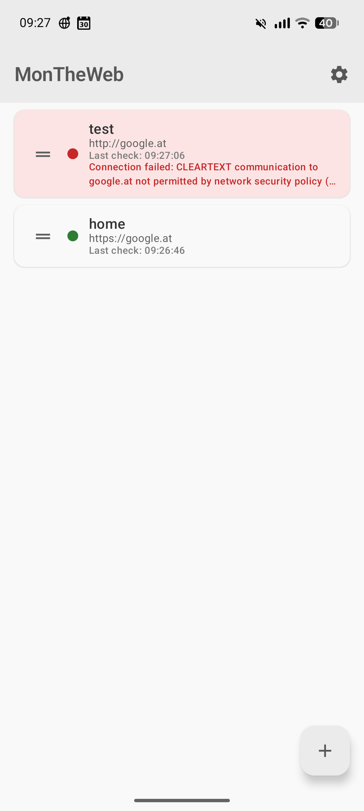
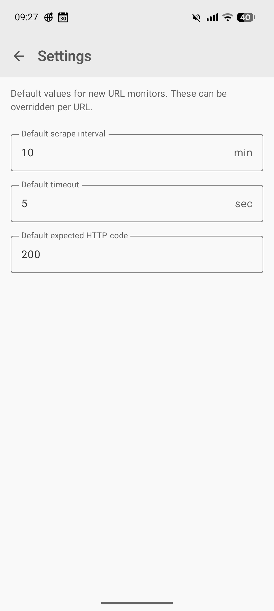
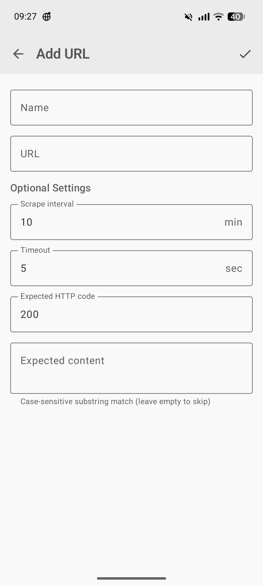
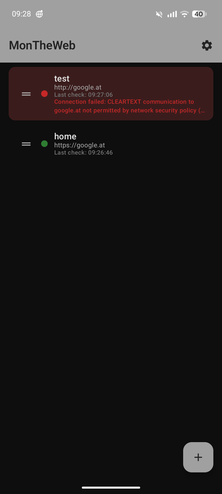
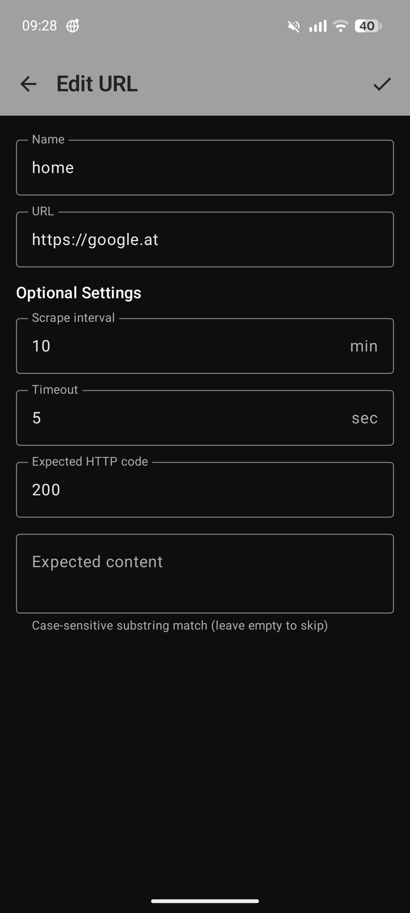

# MonTheWeb

A simple, open-source Android app for monitoring web URLs. Add URLs to a watchlist, and MonTheWeb checks them in the background at configurable intervals. When a check fails — timeout, wrong HTTP status, or missing content — you get a red indicator in the app and a system notification.

## Features

- **Background monitoring** — URLs are checked at configurable intervals, even after device reboot
- **Flexible check options** — Set per-URL: scrape interval, timeout, expected HTTP status code, expected content (case-sensitive substring match)
- **Alerts** — Failed URLs show red in the list and trigger Android system notifications; alerts clear automatically on recovery
- **Retry logic** — 5 attempts with 5-second delays before raising an alert
- **Drag-and-drop reordering** — Reorder your URL list by dragging; order persists across restarts
- **Pull-to-refresh** — Manually trigger a check of all URLs
- **Global defaults** — Settings screen for default scrape interval, timeout, and expected HTTP code
- **Material 3** — Clean, modern UI following Material Design 3 guidelines
- **Adaptive icon** — Follows your device's icon shape and color scheme
- **No tracking, no ads** — Fully open source, no telemetry

## Screenshots

<p align="center">
  
  
  
  
  
</p>

## Installation

### F-Droid

*Coming soon* — MonTheWeb will be submitted to the official F-Droid repository.

### GitHub Releases

Download the latest APK from the [Releases](https://github.com/peterloeffler/MonTheWeb/releases) page.

### Build from source

Requirements:
- Android SDK (platform 35)
- JDK 17+ (the build uses JDK 17 toolchain via Foojay auto-provisioning)

```bash
git clone https://github.com/peterloeffler/MonTheWeb.git
cd MonTheWeb
./gradlew assembleDebug
```

The debug APK will be at `app/build/outputs/apk/debug/app-debug.apk`.

For a release build:

```bash
./gradlew assembleRelease
```

Note: Release builds require signing configuration. See the [Android signing docs](https://developer.android.com/studio/publish/app-signing) for details.

## Permissions

- **Internet** — Required to check URLs
- **Run in background** — Required for periodic URL checks
- **Receive boot completed** — Required to restart monitoring after device reboot
- **Post notifications** — Required for failure alert notifications (Android 13+)

## Tech stack

- Kotlin, Jetpack Compose, Material 3
- Room (local database)
- WorkManager (background scheduling)
- DataStore (preferences)
- OkHttp (HTTP client)
- [sh.calvin.reorderable](https://github.com/Calvin-LL/Reorderable) (drag-and-drop)

## Contributing

Contributions are welcome. Please open an issue first to discuss what you'd like to change.

1. Fork the repository
2. Create a feature branch (`git checkout -b feature/my-change`)
3. Commit your changes
4. Push to your branch and open a pull request

## License

This project is licensed under the [GNU General Public License v3.0](LICENSE) (GPL-3.0-only).
